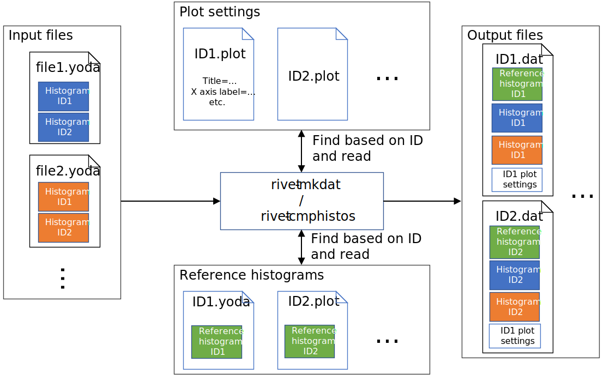
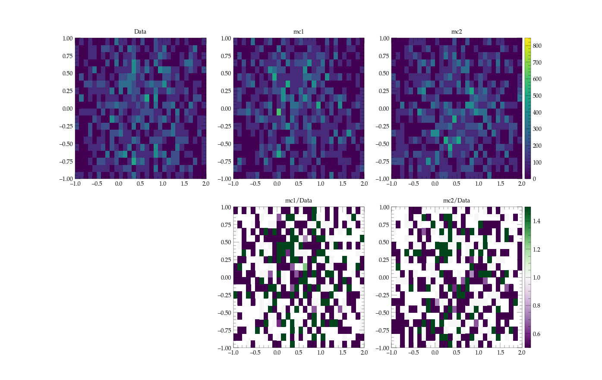
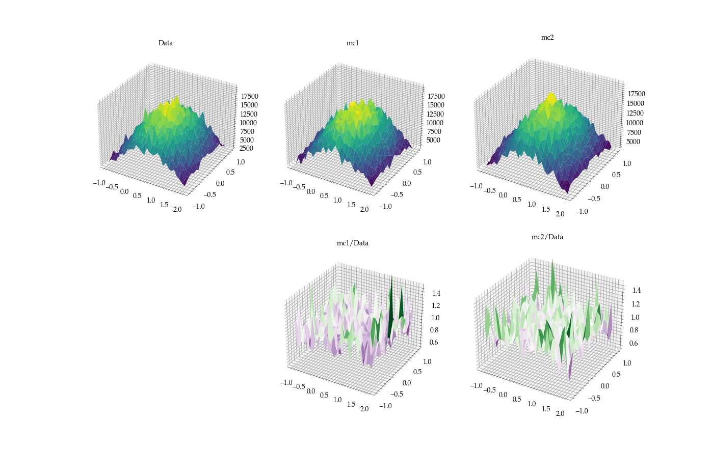

# Enhancing the Plotting Functionality in MCnet/Rivet
### Google Summer of Code 2021 Final Report - Simon Thor

# Overview
## Introduction
Rivet is a tool used by particle physicists to test and develop Monte Carlo event generators, i.e., simulations of particle accelerator collisions. Simulations are crucial for particle physics research, since they can be used to compare theoretical predictions with experimental measurements to discover new physics.

Visualizing the output is a fundamental part of Rivet, since a good visualization makes it intuitive and easy to understand the results. Currently, plots in Rivet are created by generating and compiling LaTeX commands using a custom python script. While this method does create high-quality plots, it can be slow, have memory issues, be sensitive to the deployment platform, and difficult to debug and enhance.

The goal of this project was to solve the above mentioned issues by replacing the LaTeX plotting backend with a new plotting backend, based on the `matplotlib` python package. Additionally, it was necessary to make it easy to export high-quality plots with a simple user interface that meets the needs of most users, while still allowing more customization for advanced users. The plotting program should also be able to output files representing figures in an intermediate format, which allows for easy modifications of a plot.

## Contributions
The main tasks I worked on can be separated into 4 parts:
- Making the labels and titles for the analyses in Rivet work for both LaTeX and matplotlib.
- Rewriting the `rivet-cmphistos` command.
- Making it possible to plot 2D histograms.
- Moving some of the core plotting functionality to the YODA package.

These tasks are described in further detail below. Additionally, I made som minor contributions not directly related to the main tasks, which are listed under "Other contributions".

In total, I made over 140 commits to Rivet. Most of these commits were made to the [matplotlib-GSoC](https://gitlab.com/hepcedar/rivet/-/commits/matplotlib-GSoC?author=Simon%20Thor), while some were made directly to the [main branch](https://gitlab.com/hepcedar/rivet/-/commits/matplotlib-GSoC?author=Simon%20Thor). The hyperlinks link to a list of all commits I made to each branch, of which all commits made up until 20th August 2021 are part of GSoC 2021. 
<!--TODO update this link to only target the main branch once the matplotlib code has been merged.-->

# Mathtext Compatibility
Matplotlib uses mathtext to render mathematical expressions, which is a subset of LaTeX that it can parse and render, without using a LaTeX parsing/rendering backend. Rendering with mathtext removes the need for a dependency on a LaTeX backend and typically improves performance.

Since the plotting backend will be changed from LaTeX to matplotlib, one of the goals of this project was to make all labels in Rivet compatible with mathtext. This required both manual and automatic changes to labels, where LaTeX commands were replaced by equivalent or almost equivalent commands that also work in mathtext. In addition to this, the labels with LaTeX syntax errors were fixed.

## Fixed issues
- Changed `\text` to `\mathrm`.
- Added curly braces to spots where it is missing from `\frac`, `\sqrt`, `\text`.
    - E.g., replacing `\frac12` with `\frac{1}{2}`.
- Changed `\ge` to `\geq`, `\le` to `\leq`.
- Fixed edge cases where converting `\text` to `\mathrm` does not work.
- Remove `^` from `\perp^` in `analyses/pluginCMS/CMS_2014_I1305624.plot`.
- Replace `\unit` and `\si` with alternatives, e.g., `\unit{10}{\GeV}` is converted to `10~\GeV`.
- Spaces inside former `\text` commands have been replaced by a `~`, since `\mathrm` ignores spaces while `\text` does not.
- Enclose LaTeX commands such as `\%` with $ (i.e. math mode). Otherwise, mathtext will interpret `\` as plain text. 
- Replace deprecated `\rm` command with `\mathrm`
- Remove superfluous `}` in some labels that caused LaTeX syntax errors
- Replace `\PQt` with `\mathrm{t}`, since `\PQt` is a non-standard command in LaTeX and is not recognized by matplotlib's mathtext.
- Added a label preprocessor which will replace commonly used commands, specifically `\GeV`, `\TeV`, `\pt` and `\pT`, with valid mathtext. This is applied to all labels before being plotted.

## Remaining issues
- `\micro` in LaTeX will give the same output as `$\mathrm{\mu}$` in mathtext. However, `$\mathrm{\mu}$` in LaTeX will give a [non-sensical output](https://tex.stackexchange.com/questions/569676/applying-mathrm-on-mu-leads-to-strange-symbol). This can therefore not be changed until the backend has been switched completely to mathtext.
- `\large` has no equivalent command in mathtext. Instead, one must pass a `fontsize` parameter to matplotlib. The details for how such a parameter should be passed to matplotlib has not been decided yet. As such, this cannot be changed for now.
- Some text such as `madgraph_a` cannot be parsed by LaTeX but can be parsed by matplotlib. How this should be rewritten is unclear and has thus been left as it is.

## Merge status
All mathtext-related contributions I made, besides the last point in the list above, have been merged into the main repository. The related merge requests are:
- https://gitlab.com/hepcedar/rivet/-/merge_requests/293
- https://gitlab.com/hepcedar/rivet/-/merge_requests/295
- https://gitlab.com/hepcedar/rivet/-/merge_requests/303

# Rewriting `rivet-cmphistos`
`rivet-cmphistos` is a command used in Rivet to create the intermediate format for the plotting files. 
The functionality of `rivet-cmphistos` (and its successor, `rivet-mkdat`) is described in the figure below:



The command can be called via the command line with the syntax `rivet-cmphistos file1.yoda file2.yoda`... . Here, file1.yoda, file2.yoda etc are yoda files containing histograms, each histogram with an ID corresponding to an analysis in Rivet. `rivet-cmphistos` will then create an intermediate dat file for each ID, which includes all the data and style settings for the plot. This dat file can then be plotted by `rivet-plot`, which is explained later.

To use the new backend, the inputs for `rivet-cmphistos` need to be changed, as new plot configurations were added while other are removed. This required a complete rewrite of the code behind the command, especially since the syntax for the intermediate format and .plot files were changed from a custom syntax to YAML syntax, to make the files more readable.

## Fixed issues and new features
- Rewrite most of the code inside `rivet-cmphistos` and renaming it to `rivet-mkdat` to make it work for YAML syntax files and made the code more organized.
- Implement a converter that can read the old .plot files, to remain some backwards-compatibility. 
- Add the parameter `--analysispaths`, while the parameters `--linear`,`--no-ratio`,`--rel-ratio`,`--no-plottitle`,`--remove-options` were removed. 
- Extend the capabilities of the `--style` parameter. It can now be of the format `--style some_valid_style_name:key=value:key2=value2`..., where the key is a matplotlib rcParam and value is the new value for it.

Additionally, Due to limitations to the old plotting backend, multiple 2D histograms could not be plotted in the same figure. To circumvent this, `rivet-cmphistos` would output 2D histograms with the same ID into separate .dat files, instead of keeping all 2D histograms in the same file. As an example,

Each 2D histogram is put in a separate .dat file by `rivet-cmphistos`. The name of the .dat file then also contains the file name of the input yoda file. 

### Example
If `mc1.yoda`, `mc2.yoda` both contain 2D histograms with ID `ALEPH_2019_I1737859/backLab`,
```bash
rivet-cmphistos mc1.yoda mc2.yoda
```
would give the output files
```
ALEPH_2019_I1737859/
  backLab-mc1.dat
  backLab-mc2.dat
```

The new plotting backend can plot multiple 2D histograms in the same figure (see the 2D histograms section below). No hacky behavior is therefore needed inside `rivet-mkdat` and all 2D histograms will therefore be included in the same output yaml file, just like how 1D histograms behave. The output file of `rivet-mkdat mc1.yoda mc2.yoda` is instead
```
ALEPH_2019_I1737859/
  backLab.dat
```

## Remaining issues
- While the program still can read most parts of the old .plot files, some sections are still not correctly interpreted by the file reader.
- The `--no-weights` flag has not been implemented in `rivet-mkdat`, as the detailed implementation requires more discussion with maintainers.
- `rivet-mkdat` is currently a python function (called `rivet_mkdat`) rather than a CLI command. In the future, the CLI command `rivet-mkdat` will be a thin wrapper around this python function.

## Merge status
These changes are currently in the [matplotlib-GSoC](https://gitlab.com/hepcedar/rivet/-/tree/matplotlib-GSoC/) branch and will be merged into the main branch once the new plotting backend can fully replace the current plotting backend.
The main code for `rivet-mkdat` are in 
- [rivet_mkdat.py](https://gitlab.com/hepcedar/rivet/-/blob/matplotlib-GSoC/mpl-plotting/rivet_mkdat.py)
- [old_plotfile_converter.py](https://gitlab.com/hepcedar/rivet/-/blob/matplotlib-GSoC/mpl-plotting/old_plotfile_converter.py)
- [yamlio.py](https://gitlab.com/hepcedar/rivet/-/blob/matplotlib-GSoC/mpl-plotting/yamlio.py)

# 2D histograms
To plot figures, one can pass the intermediate dat files to the `rivet-plot` command, which will create images such as PDFs and PNGs.

The old plotting backend had limited support for plotting 2D histograms. As an example, it could not plot ratios between 2D histograms, which is a crucial feature for 1D histograms in Rivet. One of the main goals of this project was therefore to enhance the 2D histogram plotting functionality. 

## New features
It is now possible to plot ratios between 2D histograms.
The image below shows an example output of the 2D histogram plotter. Th top row contains 2D histograms while the bottom row contains the ratio between the corresponding histogram in the same column and the leftmost 2D histogram in the top row (in this case it is called "Data"), which act as the reference.



I also added support for surface plots, which is an alternative to heatmaps. An example of this is shown below.



Furthermore, all the generated subplots (in the case of the figures above, there are 5 subplots) can be saved as either one image file (as in the case above) or as separate files. 

## Remaining issues
- The main 2D histogram plotting function in Rivet, `plot_2Dhist`, should be refactored, as there is some code repetition.

## Merge status
These changes are currently in the [matplotlib-GSoC](https://gitlab.com/hepcedar/rivet/-/tree/matplotlib-GSoC/) branch and will be merged into the main branch once the new plotting backend can fully replace the current plotting backend.
The main code for 2D histogram plotting in Rivet is in 
- [rivet_plot2d.py](https://gitlab.com/hepcedar/rivet/-/blob/matplotlib-GSoC/mpl-plotting/rivet_plot2d.py)

# YODA plotting API
Parts of the core plotting code will be moved to the YODA package, a histogramming package which Rivet depends on, and become a part of its plotting API. Rivet then builds upon this API. More concretely, `rivet-plot` calls the functions in the YODA plotting API to plot histograms and then adds styling and formatting to the plots. 

## Added features
The yoda plotting API for 2D histograms currently consists of the functions `heatmap`, `ratio_heatmap`, `surface`, `ratio_surface`.
A tutorial for the 2D YODA plotting API can be found in this [jupyter notebook](yoda_plot2d_demo.ipynb) 
<!--TODO change link to website or doc repo. Also update link once it has been placed in a correct location-->

## Remaining Issues
Some formatting options do not work for 3D plots the same way as for 2D plots in matplotlib requires. One can for example currently not set an axis to log scale for 3D plots.

## Merge status
The code is currently in the [matplotlib-GSoC](https://gitlab.com/hepcedar/rivet/-/tree/matplotlib-GSoC/) branch in Rivet and will be moved to YODA.
The main files I have written are 
- [yoda_plot2d.py](https://gitlab.com/hepcedar/rivet/-/blob/matplotlib-GSoC/mpl-plotting/yoda_plot/yoda_plot2d.py)
- [format_axis.py](https://gitlab.com/hepcedar/rivet/-/blob/matplotlib-GSoC/mpl-plotting/yoda_plot/format_axis.py)

# Other contributions
## Fonts
I also identified which font is being used by the old plotting backend and identified how to configure matplotlib to use the same font. Specifically, for regular text, the `URW Palladio L` font is used, while for mathematical expressions, the `PazoMath` font is used. 

These fonts are specified via an .mplstyle file, which also specifies additional matplotlib rcParams that determines how plots in Rivet should be formatted.

Currently, manual configurations of the fonts and the .mplstyle file are needed to add the Rivet style to matplotlib. This is something that needs to be improved in the future, by automating this configuration using automake, which will be executed when Rivet is installed. Some resources that are relevant to solving this issue are:
- [Where to put the mplstyle file so that matplotlib can find it](https://matplotlib.org/stable/tutorials/introductory/customizing.html#defining-your-own-style)
- [How to make matplotlib find fonts installed in a custom location](https://stackoverflow.com/a/43647344/11841986)

Additional issues and merge requests I have contributed to during GSoC:
- https://gitlab.com/hepcedar/rivet/-/issues/233
- https://gitlab.com/hepcedar/rivet/-/merge_requests/322
- https://gitlab.com/hepcedar/rivet/-/merge_requests/307
- https://gitlab.com/hepcedar/rivet/-/merge_requests/318
